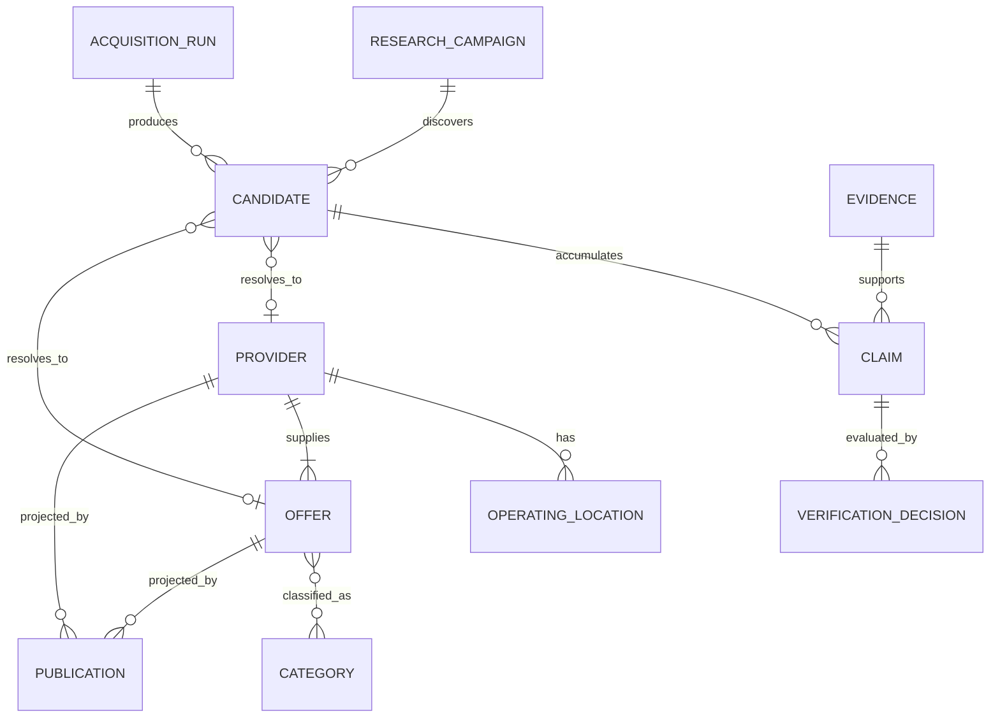

# Conceptual data model

## Design rule

Observed data and accepted data are different things. Research produces
source-attributed Claims; verification selects canonical values; publication
makes approved projections available to the Recommendation Product. History is
preserved rather than overwritten.

## Core relationships

This is conceptual cardinality. Physical tables and identifiers will be
designed during the first vertical slice.

## Research side

**Research Campaign** defines a bounded question: geographic area, event need,
category, minimum criteria, and sources.

**Acquisition Run** records one manual import, fetch, extraction, or discovery
attempt. It preserves status, timestamps, inputs, outputs, errors, and cost
metadata so experiments can be evaluated.

**Candidate** is an unresolved possible Provider, Operating Location, or Offer.
It is never public merely because it was discovered.

**Evidence** identifies the material observed by the system or an
Administrator: URL, document, submitted text, partner list, fetch time, content
fingerprint, and—where legally and operationally appropriate—a preserved raw
artifact.

**Claim** is an immutable source-attributed observation such as a phone number,
capacity, price statement, delivery area, or party restriction. A Claim stores
the asserted value, target concept, evidence, observation time, extraction
method, and confidence or review state. Confidence is not truth and does not
publish a Claim automatically.

## Canonical catalog

**Provider** is the canonical economic actor supplying Offers.

**Operating Location** is a physical place from which a Provider operates. A
venue made available to Users is modeled as an Offer, not merely as an
Operating Location.

**Offer** is the concrete recommendable service, product, package, rental, or
bookable place. One Provider may own multiple Offers.

**Category** supplies controlled classification. Common relational fields
remain explicit columns; genuinely category-specific attributes may use a
versioned definition plus JSONB values and validation. JSONB must not become an
unbounded substitute for modeling known relationships.

## Verification and publication

A **Verification Decision** evaluates one or more Claims for a defined use. It
records the Administrator, time, outcome, and rationale. Selecting a canonical
value references the supporting Claim or the documented derivation.

A **Publication** creates or updates the public projection from approved
canonical values. Published data keeps references to its verification basis and
timestamps. A correction adds Claims and decisions; it does not delete the
history that explained the previous state.

Reverification is triggered by age, changed evidence, contradiction, source
risk, or explicit Administrator action. Freshness policy is defined per field
or Claim type rather than by one global expiration interval.

## Audit and deletion

Sensitive mutations record actor, timestamp, action, target, and relevant before
and after references. Audit events support accountability but do not replace
domain state.

Raw evidence retention and deletion rules remain subject to legal review and
source terms. The model must support deleting or restricting a raw artifact
without corrupting the provenance metadata and decisions that depended on it.
