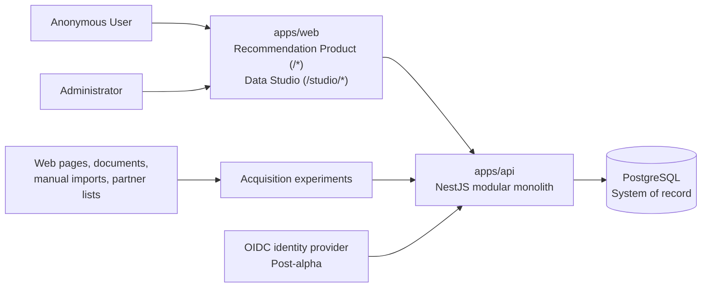

# System overview

## Purpose

ELPA builds a traceable catalog of event-related Providers and Offers, then
uses only approved data to produce explainable recommendations. Data Studio is
the internal curation product; the Recommendation Product is the anonymous
public product. Both audiences share one client application, `apps/web`, split
by route family (ADR 0015).

## System context

The client uses the REST API through a generated OpenAPI client that lives
inside `apps/web/src/lib/apiClient/`. Route-family separation and two
`beforeLoad` policies enforce the audience split at the UX layer; the API
enforces authorization on every request. The client's authentication surface
is confined to `apps/web/src/lib/identity/`, a boundary module that reads
`GET /api/me` through TanStack Query — no login UI exists in alpha and no
identity variables live on the client (ADR 0008/0009/0010). In non-production
runtimes the responses are supplied by an MSW mock backend confined to
`apps/web/src/mocks/` and gated by `VITE_APP_ENV` and `VITE_ENABLE_MOCKS`;
production builds refuse to boot the worker (ADR 0016).

## Deployables

| Deployable | Responsibility                                                                             | Access                                                                                                |
| ---------- | ------------------------------------------------------------------------------------------ | ----------------------------------------------------------------------------------------------------- |
| `apps/api` | Shared REST API, domain workflows, persistence, and OpenAPI contract                       | Public and administrative routes with explicit authorization boundaries                               |
| `apps/web` | Anonymous Recommendation Product at `/*`; Administrator-guarded Data Studio at `/studio/*` | Public for `/*`; simulated Administrator identity in protected alpha for `/studio/*`, OIDC post-alpha |

The API is a single deployment. `apps/web` is a static SPA served from a
managed platform. PostgreSQL is managed in hosted environments and runs
through Docker Compose locally. The concrete provider remains open, with AWS
and Google Cloud shortlisted.

## Initial API modules

These are module responsibilities inside one NestJS application, not separate
services:

| Module             | Owns                                                                                                     |
| ------------------ | -------------------------------------------------------------------------------------------------------- |
| **Access**         | Simulated alpha identity, later OIDC token validation, Administrators, invitations, and authorization    |
| **Research**       | Research Campaigns, Candidates, acquisition runs, Evidence, raw source references, and proposed Claims   |
| **Catalog**        | Canonical Providers, Operating Locations, Offers, Categories, and category attributes                    |
| **Curation**       | Duplicate resolution, verification decisions, canonical value selection, publication, and reverification |
| **Recommendation** | Anonymous requests, eligibility filters, ranking inputs, explanations, and uncertainty output            |
| **Audit**          | Actor-attributed records for sensitive mutations and administrative actions                              |

Modules communicate through explicit application contracts. They may share a
database deployment, but one module must not mutate another module's tables
through ad hoc queries.

## Contract boundary

The API exposes REST/JSON. NestJS produces the OpenAPI document, and
`apps/web/src/lib/apiClient/` is generated from that document. The client
never imports controllers, DTO implementations, Drizzle schemas, or domain
internals from `apps/api`. Distinct DTOs per projection
(`PublishedOffer` versus `Offer`, `PublishedProvider` versus `Provider`,
etc.) keep the published-versus-canonical boundary from ADR 0013 encoded in
the generated types; an ESLint `no-restricted-imports` boundary prevents
admin API namespaces from being reached from `recommendation/` or from the
`_public` layout.

## Processing model

Manual curation and URL import come first. Fetching, extraction, and duplicate
suggestions may become asynchronous because their duration and failure modes are
unpredictable. The initial experiments must measure those characteristics
before selecting a queue or worker topology. Every run receives durable status,
input, output, error, timing, and cost metadata in PostgreSQL.

## Security boundaries

- Anonymous Users can access only published recommendation capabilities.
- Data Studio alpha uses one simulated Administrator identity only in local or
  infrastructure-protected private environments.
- Simulated identity must fail closed in a public production environment.
- Post-alpha identity comes from an external OIDC provider; ELPA remains
  authoritative for membership, roles, authorization, and audit history.
- Raw evidence and unpublished Claims are never exposed through public routes.

## Deferred decisions

- AWS versus Google Cloud and the infrastructure-as-code tool.
- OIDC provider.
- Queue or worker technology, pending acquisition experiments.
- Recommendation ranking implementation, pending a curated evaluation dataset.
