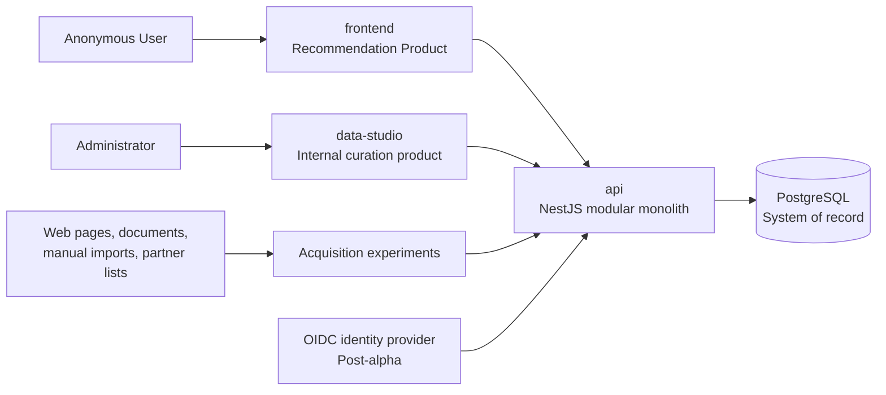

# System overview

## Purpose

ELPA builds a traceable catalog of event-related Providers and Offers, then
uses only approved data to produce explainable recommendations. Data Studio is
the internal curation product; `frontend` is the public Recommendation Product.

## System context

Both client applications use the same REST API and generated OpenAPI client.
They are separate deployables and do not import code from each other.

## Deployables

| Deployable | Responsibility | Initial access |
| --- | --- | --- |
| `apps/api` | Shared REST API, domain workflows, persistence, and OpenAPI contract | Public and administrative routes with explicit boundaries |
| `apps/frontend` | Anonymous Recommendation Product | Public |
| `apps/data-studio` | Research, curation, verification, publication, and reverification | Simulated Administrator identity in protected alpha |

The API is a single deployment. PostgreSQL is managed in hosted environments
and runs through Docker Compose locally. The concrete provider remains open,
with AWS and Google Cloud shortlisted.

## Initial API modules

These are module responsibilities inside one NestJS application, not separate
services:

| Module | Owns |
| --- | --- |
| **Access** | Simulated alpha identity, later OIDC token validation, Administrators, invitations, and authorization |
| **Research** | Research Campaigns, Candidates, acquisition runs, Evidence, raw source references, and proposed Claims |
| **Catalog** | Canonical Providers, Operating Locations, Offers, Categories, and category attributes |
| **Curation** | Duplicate resolution, verification decisions, canonical value selection, publication, and reverification |
| **Recommendation** | Anonymous requests, eligibility filters, ranking inputs, explanations, and uncertainty output |
| **Audit** | Actor-attributed records for sensitive mutations and administrative actions |

Modules communicate through explicit application contracts. They may share a
database deployment, but one module must not mutate another module's tables
through ad hoc queries.

## Contract boundary

The API exposes REST/JSON. NestJS produces the OpenAPI document, and
`packages/api-client` is generated from that document for both clients. Client
applications never import controllers, DTO implementations, Drizzle schemas,
or domain internals from `apps/api`.

## Processing model

Manual curation and URL import come first. Fetching, extraction, and duplicate
suggestions may become asynchronous because their duration and failure modes are
unpredictable. The initial experiments must measure those characteristics
before selecting a queue or worker topology. Every run receives durable status,
input, output, error, timing, and cost metadata in PostgreSQL.

## Security boundaries

- Anonymous Users can access only published recommendation capabilities.
- Data Studio alpha uses one simulated Administrator identity only in local or
  infrastructure-protected private environments.
- Simulated identity must fail closed in a public production environment.
- Post-alpha identity comes from an external OIDC provider; ELPA remains
  authoritative for membership, roles, authorization, and audit history.
- Raw evidence and unpublished Claims are never exposed through public routes.

## Deferred decisions

- Client framework and component library, owned by Alin; React, TypeScript, and
  Material UI are leading candidates only.
- AWS versus Google Cloud and the infrastructure-as-code tool.
- OIDC provider.
- Queue or worker technology, pending acquisition experiments.
- Recommendation ranking implementation, pending a curated evaluation dataset.
